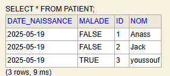
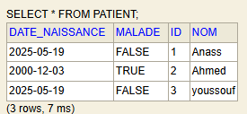
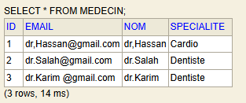
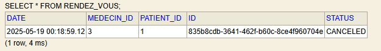
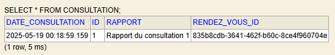
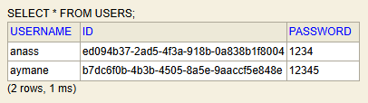
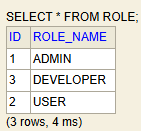
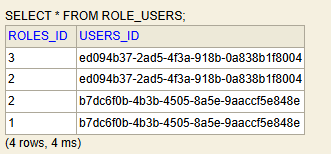

# TP N°2 - ORM JPA HIbernate et Spring Data

Ce projet est une application Spring Boot permettant la gestion de patients, médecins, rendez-vous, consultations, utilisateurs et rôles. Il s'appuie sur Spring Data JPA pour la persistance des données, H2/MySQL comme bases de données, et utilise Lombok pour réduire le code boilerplate.

## 🛠 Technologies utilisées

- Java 17+
- Spring Boot
  - Spring Web
  - Spring Data JPA
- H2 Database (puis migration vers MySQL)
- MySQL
- Lombok
- Maven

---

## 📁 Structure du projet

```

\---target
+---classes
\|   |   application.properties
\|   |
\|   ---com
\|       ---example
\|           ---tp2patientsapp
\|               |   Tp2PatientsAppApplication.class
\|               |
\|               +---entities
\|               |       Patient.class
\|               |       Medecin.class
\|               |       RendezVous.class
\|               |       Consultation.class
\|               |       User.class
\|               |       Role.class
\|               |       StatusRDV.class
\|               |
\|               +---repository
\|               |       PatientRepository.class
\|               |       MedecinRepository.class
\|               |       RendezVousRepository.class
\|               |       ConsultationRepository.class
\|               |       UserRepository.class
\|               |       RoleRepository.class
\|               |
\|               ---service
\|                       IHospitalService.class
\|                       HospitalServiceImpl.class
\|                       IUserService.class
\|                       UserServiceImpl.class

````

---

## ✅ Étapes Réalisées

### 1. Création du projet Spring Initializer

Le projet a été généré avec les dépendances suivantes :
- Spring Web
- Spring Data JPA
- H2 Database
- Lombok

### 2. Entités 
### Entité `Patient` 

L'entité `Patient` est une entité JPA avec les attributs suivants :

```java
@Entity
@Data @NoArgsConstructor
@AllArgsConstructor
public class Patient {
    @Id @GeneratedValue(strategy = GenerationType.IDENTITY)
    private Long id;
    private String nom;
    @Temporal(TemporalType.DATE)
    private Date dateNaissance;
    private boolean malade;
    //    private int score;
    @OneToMany(mappedBy = "patient",fetch = FetchType.LAZY)
    private Collection<RendezVous> rendezVous;

}
````
### Entité `Medecin`
```java
@Entity
@Data @NoArgsConstructor
@AllArgsConstructor
public class Medecin {
    @Id @GeneratedValue(strategy = GenerationType.IDENTITY)
    private Long id;
    private String nom;
    private String email;
    private String specialite;
    @OneToMany (mappedBy = "medecin",fetch = FetchType.LAZY)
    private Collection<RendezVous> rendezVous;
}
````

### Entité `RendezVous`
```` java
@Component
@Entity
@Data @NoArgsConstructor
@AllArgsConstructor
public class RendezVous {
    @Id
    private String id;
    private Date date;
    @Enumerated(EnumType.STRING)
    private StatusRDV status;
    @ManyToOne
    private Patient patient;
    @ManyToOne
    private Medecin medecin;
    @OneToOne (mappedBy = "rendezVous")
    private Consultation consultation;}
````
### Entité `Consultation`
```` java
@Entity
@Data @NoArgsConstructor
@AllArgsConstructor
@Component
public class Consultation {
    @Id @GeneratedValue(strategy = GenerationType.IDENTITY)
    private Long id;
    private Date dateConsultation;
    private String rapport;
    @OneToOne
    private RendezVous rendezVous;
}
````
### Entité `User`
```` java
@Entity
@Table(name = "USERS")
@Data @NoArgsConstructor
@AllArgsConstructor
public class User {
    @Id
    private String id;
    @Column(unique = true, nullable = false, length = 20)
    private String username;
    private String password;
    @ManyToMany(mappedBy = "users", fetch = FetchType.EAGER)
    private List<Role> roles = new ArrayList<>();
}
````
### Entité `Role`
```` java
@Entity
@Data @NoArgsConstructor
@AllArgsConstructor
public class Role {
    @Id @GeneratedValue(strategy = GenerationType.IDENTITY)
    private Long id;
    @Column(nullable = false, unique = true, length = 20)
    private String roleName;
    @ManyToMany(fetch = FetchType.EAGER)
//    Par defaut sera USERS_ROLES
//    @JoinTable(name = "USERS_ROLES")
    @ToString.Exclude
    private List<User> users = new ArrayList<>();
}
````
### 3. Configuration H2 (`application.properties`)

```properties
spring.application.name=TP2-Patients-App
server.port=8085
#----------Configuration pour H2------------
spring.datasource.url=jdbc:h2:mem:patients-db
spring.h2.console.enabled=true
```

### 4. Repository JPA et Execution :
### 4.1 Opération sur `Patient` :
* ### `patientRepository` :
```java
@Repository
public interface PatientRepository extends JpaRepository<Patient, Long> {
}
```
* ###  Fonction pour ajouter un patient dans la classe `AppApplication` :
```java
 hostpitalService.savePatient(new Patient(null,"Anass", new Date(), false,null));
            hostpitalService.savePatient(new Patient(null,"Jack", new Date(), false,null));
            hostpitalService.savePatient(new Patient(null,"youssouf", new Date(), true,null));
````
  * ###  Réultat lors de l'execution :

* ###  Fonction pour modifer le (nom/la date de naissance/si malade) d'un patient :

````java
    @Modifying
    @Transactional
    @Query("UPDATE Patient p set p.nom = :nom WHERE p.id = :id")
    void updatePatientNom(@Param("nom") String nom, @Param("id") Long id);

    @Modifying
    @Transactional
    @Query("UPDATE Patient p set p.dateNaissance = :date WHERE p.id = :id")
    void updatePatientDate(@Param("date")LocalDate date, @Param("id") Long id);

    @Modifying
    @Transactional
    @Query("UPDATE Patient p set p.malade = :malade WHERE p.id = :id")
    void updatePatientMalade(@Param("malade") Boolean malade, @Param("id") Long id);
````

* ###  Implementation de la fonction pour modifier un patient dans la classe `AppApplication` :
````java
            ////     -----------------Modifer le nom du patient---------------------
        hostpitalService.updatePatientNom("Ahmed",2L);
        Patient pUpdate = patientRepository.findById(2L).get();
        System.out.println("-------------Patient apres la modéfication-------");
        System.out.println("Patient Id: " + pUpdate.getId());
        System.out.println("Patient Nom: " + pUpdate.getNom());
        System.out.println("Patient Date Naissance: " + pUpdate.getDateNaissance());
            ////     -----------------Modifer la Date de naissance du patient---------------------
        hostpitalService.updatePatientDate(LocalDate.of(2000,12,03),2L);
            ////     -----------------Modifer l'etat' du patient---------------------
        hostpitalService.updatePatientMalade(false,3L);
        hostpitalService.updatePatientMalade(true,2L);
        
            //// ---------------- Supprimer Un patient-------------------
        hostpitalService.deletePatient(3L);
````
* ###  Réultat après modifications lors de l'execution :


---
### 4.2 Opération sur `Medecin` :
* ### `MedecinRepository` :
````java
@Repository
public interface MedecinRepository extends JpaRepository<Medecin, Long> {
    Medecin findByNomContains(String nom);
}
````
* ### Fonction pour ajouter un medecin dans la class `HospitalService` :
```java
    @Override
    public Medecin saveMedecin(Medecin medecin) {
        return medecinRepository.save(medecin);
    }
```
* ###  Implementation de la fonction pour ajouter un medecin dans la classe `AppApplication` :
````java
//// ---------------Ajouter des Medecins------------------------
Stream.of("dr,Hassan","dr.Salah","dr.Karim ")
        .forEach(name -> {
            Medecin medecin = new Medecin();
            medecin.setNom(name);
            medecin.setEmail(name+"@gmail.com");
            medecin.setSpecialite(Math.random()>0.4?"Cardio":"Dentiste");
            hostpitalService.saveMedecin(medecin);
      });
````
* ###  Réultat lors de l'execution :


---
### 4.3 Opération sur `RendezVous` :

* ### `RendezVousRepository` :
````java
@Repository
public interface RendezVousRepository extends JpaRepository<RendezVous, Long> {
}
````
* ### Fonction pour ajouter un rendez-vous dans la class `HospitalServiceImpl` :
```java
    @Override
public RendezVous saveRendezVous(RendezVous rendezVous) {
  rendezVous.setId(UUID.randomUUID().toString());
  return rendezVousRepository.save(rendezVous);
}
```
* ###  Implementation de la fonction pour ajouter un rendez-vous dans la classe `AppApplication` :
````java
//// ---------------Ajouter des Medecins------------------------
// -------------Ajouter des rendezèvous-----------------------
Medecin m1 = medecinRepository.findByNomContains("Karim");
RendezVous r1 = new RendezVous();
r1.setDate(new Date());
r1.setStatus(StatusRDV.CANCELED);
r1.setMedecin(m1);
r1.setPatient(p1);
hostpitalService.saveRendezVous(r1);
````
* ###  Réultat lors de l'execution :


---
### 4.4 Opération sur `Consultation` :

* ### `ConsultationRepository` :
````java
@Repository
  public interface ConsltationRepository extends JpaRepository<Medecin, Long> {
}
````
* ### Fonction pour ajouter une consultation dans la class `HospitalService` :
```java
    @Override
    public Medecin saveConsultation(Medecin medecin) {
        return consultationRepository.save(medecin);
    }
```
* ###  Implementation de la fonction pour ajouter une consultation dans la classe `AppApplication` :
````java
// -----------------Ajouter des Consultations-------------------------
RendezVous r2 = rendezVousRepository.findAll().get(0);
Consultation c1 = new Consultation();
        c1.setDateConsultation(new Date());
        c1.setRendezVous(r2);
        c1.setRapport("Rapport du consultation 1");
        hostpitalService.saveConsultation(c1);
````
* ###  Réultat lors de l'execution :


---
### 4.5 Opération sur `Users` :

* ### `UserRepository` :
````java
@Repository
public interface UserRepository extends JpaRepository<User,String> {
  User findByUsername(String username);
}
````
* ### Fonction pour ajouter un user dans la class `UserServiceImpl` :
```java
    @Override
    public User addNewuser(User user) {
      user.setId(UUID.randomUUID().toString());
      return userRepository.save(user);
}
```
* ### Fonction pour chercher un utilisatuer dans la class `UserServiceImpl` :
```java
    @Override
public Role findUserByUsername(String username) {
  return userRepository.findByRoleName(username);
}
```
* ###  Implementation de la fonction pour ajouter un medecin dans la classe `AppApplication` :
````java
//// ---------------Ajouter des Users------------------------
    User u1 = new User();
    u1.setUsername("anass");
    u1.setPassword("1234");
    userService.addNewuser(u1);

    User u2 = new User();
    u2.setUsername("aymane");
    u2.setPassword("12345");
    userService.addNewuser(u2);

````
* ###  Réultat lors de l'execution :



* ### Fonction pour Authentification dans la class `UserServiceImpl` :
```java
    @Override
public User authenticate(String username, String password) {
  User user = findUserByUsername(username);
  if (user == null) throw new RuntimeException("Invalid username or password");
  if (user.getPassword().equals(password)) {
    return user;
  }
  throw new RuntimeException("Invalid username or password");
}}
````

* ###  Implementation de la fonction d'authentification dans la classe `AppApplication` :
````java
//        ---------------Authentification------------
        try {
User conUser = userService.authenticate("anass","1234");
        System.out.println("Connection reussite : ");
        System.out.println(conUser.getId());
        System.out.println(conUser.getUsername());
        System.out.println("Roles : ");
            conUser.getRoles().forEach(role->{
                System.out.println("Role : "+role);
            });
````
* ###  Réultat lors de l'execution :

[//]: # (![Affichage des utilisateurs]&#40;docs/img_8.png&#41;)
````terminaloutput
Connection reussite : 
ed094b37-2ad5-4f3a-918b-0a838b1f8004
anass
Roles : 
Role : Role(id=3, roleName=DEVELOPER)
Role : Role(id=2, roleName=USER)
````
----
### 4.6 Opération sur `Role` :

* ### `RoleRepository` :
````java
@Repository
public interface RoleRepository extends JpaRepository<Role,Long> {
  Role findByRoleName(String roleName);
}
````
* ### Fonction pour ajouter un role dans la class `UserServiceImpl` :
```java
    @Override
  public Role addNewrole(Role role) {
    return roleRepository.save(role);
}
```
* ### Fonction pour chercher un role dans la class `UserServiceImpl` :
```java
    @Override
public Role findRoleByRolename(String rolename) {
  return roleRepository.findByRoleName(rolename);
}
```

* ### Fonction pour affecter un role à un utilisateur dans la class `UserServiceImpl` :
```java
    @Override
public void addRoleToUser(String username, String rolename) {
  User user = findUserByUsername(username);
  Role role = findRoleByRolename(rolename);
  if (user.getRoles() != null) {
    user.getRoles().add(role);
    role.getUsers().add(user);
  }
}
```
* ###  Implementation de la fonction pour ajouter un medecin dans la classe `AppApplication` :
````java
//// ---------------Ajouter des Roles------------------------
    Stream.of("ADMIN","USER","DEVELOPER")
            .forEach(r->{
                Role role = new Role();
                role.setRoleName(r);
                userService.addNewrole(role);
            });
````

* ###  Implementation de la fonction pour affecter un role à un utilisateur dans la classe `AppApplication` :
````java
//// ---------------affecter des Roles------------------------
        userService.addRoleToUser("anass","USER");
        userService.addRoleToUser("anass","DEVELOPER");
        userService.addRoleToUser("aymane","USER");
        userService.addRoleToUser("aymane","ADMIN");
````
* ###  Réultat lors de l'execution :



---

### 5. Opérations et foncionnalités :
Les opérations suivantes ont été testées via un `CommandLineRunner` :

* **Ajout de patients/ medecin/ RendezVous/ Consultation/ Utilisateur/ Role**
* **Affichage de tous les entités**
* **Consultation d’un entité par ID/ username**
* **Recherche de patients et des medecins par nom**
* **Mise à jour des données**
* **Suppression d’un patient**

### 6. Migration vers MySQL

Remplacement de H2 par MySQL dans `application.properties` :

```properties
#-----------Migration vers MySQL-------------
spring.datasource.url=jdbc:mysql://localhost:3306/patients-db?createDatabaseIfNotExist=true
spring.datasource.username=root
spring.datasource.password=
spring.jpa.hibernate.ddl-auto=create
spring.jpa.properties.hibernate.dialect=org.hibernate.dialect.MariaDBDialect
```


